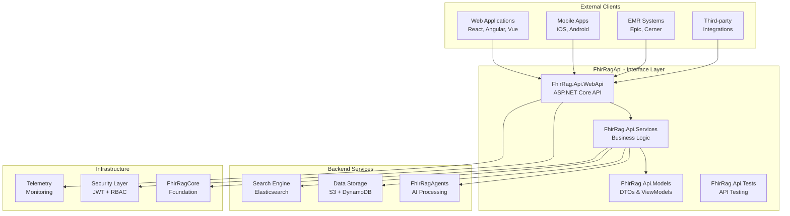

# FhirRag API

## 🎯 Solution Overview

The **FhirRagApi** solution provides a comprehensive REST API layer for the FHIR RAG system, enabling secure, high-performance access to processed FHIR data with advanced querying capabilities, AI-powered insights, and multi-tenant healthcare data management. This solution serves as the primary interface for web applications, mobile clients, and EMR system integrations.

## 🏗️ Architecture Role



## 📦 Projects

### FhirRag.Api.WebApi
**ASP.NET Core Web API with comprehensive FHIR endpoints**

- **Purpose**: RESTful API providing secure access to FHIR RAG functionality
- **Framework**: ASP.NET Core 9.0 with minimal APIs and controllers
- **Key Features**:
  - FHIR R4 compliant endpoints
  - OpenAPI/Swagger documentation
  - Multi-tenant request routing
  - Rate limiting and throttling
  - Health checks and monitoring
  - Real-time SignalR integration

### FhirRag.Api.Services
**Business logic and orchestration services**

- **Purpose**: Core business logic layer coordinating between API and backend services
- **Key Features**:
  - FHIR resource management services
  - Clinical query processing
  - Search and filtering logic
  - Caching and performance optimization
  - Audit logging and compliance
  - Integration with AI agents

### FhirRag.Api.Models
**Data transfer objects and view models**

- **Purpose**: API contract definitions and data models for external communication
- **Key Components**:
  - FHIR resource DTOs
  - Query request/response models
  - Clinical insight view models
  - API error response models
  - Pagination and filtering models

### FhirRag.Api.Tests
**Comprehensive API testing suite**

- **Purpose**: Ensure API reliability, security, and performance
- **Test Types**:
  - Unit tests for service layer
  - Integration tests for API endpoints
  - Security and authorization tests
  - Performance and load tests
  - Contract testing for external integrations

## 🔗 API Endpoints Overview

### FHIR Resource Endpoints
```http
# Patient management
GET    /api/v1/patients
POST   /api/v1/patients
GET    /api/v1/patients/{id}
PUT    /api/v1/patients/{id}
PATCH  /api/v1/patients/{id}
DELETE /api/v1/patients/{id}

# Clinical resources
GET    /api/v1/observations
GET    /api/v1/conditions
GET    /api/v1/medications
GET    /api/v1/procedures

# Bulk operations
POST   /api/v1/bulk/export
GET    /api/v1/bulk/status/{id}
GET    /api/v1/bulk/download/{id}
```

### AI-Powered Endpoints
```http
# Clinical AI queries
POST   /api/v1/clinical-ai/query
POST   /api/v1/clinical-ai/insights
GET    /api/v1/clinical-ai/risk-assessment/{patientId}

# Care management
GET    /api/v1/care-gaps/{patientId}
GET    /api/v1/quality-measures/{patientId}
POST   /api/v1/clinical-recommendations
```

### Search and Analytics
```http
# Advanced search
GET    /api/v1/search/patients
GET    /api/v1/search/resources
POST   /api/v1/search/complex-query

# Analytics
GET    /api/v1/analytics/population-health
GET    /api/v1/analytics/quality-metrics
GET    /api/v1/analytics/outcomes
```

## 🔄 Dependencies

### Internal Dependencies
- **FhirRagCore**: Foundation libraries (security, telemetry, domain models)
- **FhirRagAgents**: AI processing and clinical insights
- **Infrastructure Services**: Data access and cloud integrations

### External Dependencies
- **ASP.NET Core 9.0**: Web API framework
- **Entity Framework Core**: Data access (if using relational data)
- **AutoMapper**: Object-to-object mapping
- **FluentValidation**: Request validation
- **Swashbuckle**: OpenAPI documentation
- **HealthChecks**: Application health monitoring
- **SignalR**: Real-time communication

### Third-Party Integrations
- **AWS SDK**: Cloud service integration
- **Elasticsearch.Net**: Advanced search capabilities
- **Redis**: Distributed caching
- **Application Insights**: Performance monitoring

## 🚀 Deployment Instructions

### Prerequisites
- .NET 9.0 SDK
- AWS CLI or Azure CLI (depending on cloud provider)
- Docker (for containerized deployment)

### Local Development
```bash
# Navigate to API project
cd solutions/FhirRagApi

# Restore dependencies
dotnet restore

# Update database (if using EF migrations)
dotnet ef database update --project FhirRag.Api.WebApi

# Run locally
dotnet run --project FhirRag.Api.WebApi
```

### Docker Deployment
```bash
# Build Docker image
docker build -t fhir-rag-api -f FhirRag.Api.WebApi/Dockerfile .

# Run container
docker run -d -p 8080:80 \
  -e ASPNETCORE_ENVIRONMENT=Production \
  -e ConnectionStrings__DefaultConnection="your-connection-string" \
  --name fhir-rag-api \
  fhir-rag-api
```

### AWS Deployment
```bash
# Deploy to ECS/Fargate
aws ecs create-service \
  --cluster fhir-rag-cluster \
  --service-name fhir-rag-api \
  --task-definition fhir-rag-api:1 \
  --desired-count 3

# Deploy to Lambda (for serverless)
dotnet lambda deploy-serverless --template serverless.template
```

## ⚙️ Configuration

### API Configuration (appsettings.json)
```json
{
  "FhirRagApi": {
    "Versioning": {
      "DefaultVersion": "1.0",
      "SupportedVersions": ["1.0", "1.1"],
      "VersioningStrategy": "HeaderVersion"
    },
    "RateLimiting": {
      "RequestsPerMinute": 1000,
      "BurstLimit": 2000,
      "EnableRateLimiting": true
    },
    "Caching": {
      "DefaultTtlMinutes": 15,
      "PatientDataTtlMinutes": 5,
      "SearchResultsTtlMinutes": 30
    },
    "Pagination": {
      "DefaultPageSize": 50,
      "MaxPageSize": 1000
    }
  },
  "Authentication": {
    "Jwt": {
      "Authority": "https://your-identity-provider.com",
      "Audience": "fhir-rag-api",
      "RequireHttpsMetadata": true
    },
    "ApiKey": {
      "HeaderName": "X-API-Key",
      "EnableApiKeyAuth": true
    }
  },
  "HealthChecks": {
    "EnableHealthChecks": true,
    "HealthCheckEndpoint": "/health",
    "DetailedHealthEndpoint": "/health/detailed"
  }
}
```

### Environment Variables
```bash
# Core API settings
ASPNETCORE_ENVIRONMENT=Production
ASPNETCORE_URLS=http://+:80
FHIR_RAG_API_VERSION=1.0

# Database connections
ConnectionStrings__DefaultConnection=your-connection-string
ConnectionStrings__RedisConnection=your-redis-connection

# Security
JWT_AUTHORITY=https://your-identity-provider.com
JWT_AUDIENCE=fhir-rag-api
API_KEY_SECRET=your-api-key-secret

# External services
FHIR_RAG_AGENTS_ENDPOINT=https://agents-api.fhir-rag.com
ELASTICSEARCH_ENDPOINT=https://search.fhir-rag.com
AWS_REGION=us-east-1

# Performance
ENABLE_RESPONSE_CACHING=true
ENABLE_RATE_LIMITING=true
MAX_CONCURRENT_REQUESTS=1000
```

## 🧪 Testing Strategy

### API Testing Framework
```bash
# Run all API tests
dotnet test --configuration Release

# Run integration tests
dotnet test --configuration Release --filter Category=Integration

# Run performance tests
dotnet test --configuration Release --filter Category=Performance

# Generate test coverage report
dotnet test --collect:"XPlat Code Coverage" --results-directory ./TestResults/
```

### Test Categories

#### Unit Tests
```csharp
[TestMethod]
[TestCategory("Unit")]
public async Task PatientService_GetPatient_ReturnsCorrectPatient()
{
    // Arrange
    var patientId = "patient-123";
    var mockRepository = new Mock<IPatientRepository>();
    mockRepository.Setup(r => r.GetByIdAsync(patientId, It.IsAny<string>()))
              .ReturnsAsync(CreateTestPatient(patientId));
    
    var service = new PatientService(mockRepository.Object);
    
    // Act
    var result = await service.GetPatientAsync(patientId, "tenant-1");
    
    // Assert
    Assert.IsNotNull(result);
    Assert.AreEqual(patientId, result.Id);
}
```

#### Integration Tests
```csharp
[TestMethod]
[TestCategory("Integration")]
public async Task GET_Patients_WithValidTenant_ReturnsPatients()
{
    // Arrange
    var client = _factory.CreateClientWithAuth("tenant-1", "user-1");
    
    // Act
    var response = await client.GetAsync("/api/v1/patients");
    
    // Assert
    response.EnsureSuccessStatusCode();
    var content = await response.Content.ReadAsStringAsync();
    var patients = JsonSerializer.Deserialize<List<PatientDto>>(content);
    Assert.IsTrue(patients.Count > 0);
}
```

#### Performance Tests
```csharp
[TestMethod]
[TestCategory("Performance")]
public async Task PatientSearch_ShouldHandleHighConcurrency()
{
    var tasks = new List<Task>();
    var client = _factory.CreateClient();
    
    // Simulate 100 concurrent requests
    for (int i = 0; i < 100; i++)
    {
        tasks.Add(client.GetAsync("/api/v1/search/patients?name=test"));
    }
    
    var results = await Task.WhenAll(tasks);
    
    // Assert all requests completed successfully
    Assert.IsTrue(results.All(r => r.IsSuccessStatusCode));
}
```

## 🔒 Security Implementation

### Authentication & Authorization
```csharp
// JWT authentication setup
services.AddAuthentication(JwtBearerDefaults.AuthenticationScheme)
    .AddJwtBearer(options =>
    {
        options.Authority = configuration["Authentication:Jwt:Authority"];
        options.Audience = configuration["Authentication:Jwt:Audience"];
        options.TokenValidationParameters = new TokenValidationParameters
        {
            ValidateIssuer = true,
            ValidateAudience = true,
            ValidateLifetime = true,
            ValidateIssuerSigningKey = true,
            ClockSkew = TimeSpan.Zero
        };
    });

// Policy-based authorization
services.AddAuthorization(options =>
{
    options.AddPolicy("ReadPatients", policy =>
        policy.RequireClaim("permissions", "read:patients"));
    options.AddPolicy("WritePatients", policy =>
        policy.RequireClaim("permissions", "write:patients"));
    options.AddPolicy("AdminAccess", policy =>
        policy.RequireClaim("role", "admin"));
});
```

### Multi-Tenant Security
```csharp
[ApiController]
[Route("api/v1/[controller]")]
[Authorize]
public class PatientsController : ControllerBase
{
    [HttpGet]
    [Authorize(Policy = "ReadPatients")]
    public async Task<IActionResult> GetPatients(
        [FromQuery] PatientSearchRequest request)
    {
        var securityContext = GetSecurityContext();
        
        // Ensure tenant isolation
        request.TenantId = securityContext.TenantId;
        
        var patients = await _patientService.SearchPatientsAsync(request);
        return Ok(patients);
    }
    
    private SecurityContext GetSecurityContext()
    {
        return new SecurityContext
        {
            UserId = User.FindFirst("sub")?.Value,
            TenantId = User.FindFirst("tenant_id")?.Value,
            Permissions = User.FindAll("permissions").Select(c => c.Value).ToList()
        };
    }
}
```

### Data Validation
```csharp
public class CreatePatientRequestValidator : AbstractValidator<CreatePatientRequest>
{
    public CreatePatientRequestValidator()
    {
        RuleFor(x => x.Identifier)
            .NotEmpty()
            .Length(1, 50)
            .Matches(@"^[A-Za-z0-9\-]+$");
            
        RuleFor(x => x.GivenName)
            .NotEmpty()
            .Length(1, 100);
            
        RuleFor(x => x.FamilyName)
            .NotEmpty()
            .Length(1, 100);
            
        RuleFor(x => x.BirthDate)
            .LessThan(DateTime.Now)
            .GreaterThan(DateTime.Now.AddYears(-150));
    }
}
```

## 📊 Performance & Monitoring

### Performance Characteristics
- **Throughput**: 10,000+ requests per minute
- **Latency**: 
  - Simple queries: < 100ms
  - Complex searches: < 500ms
  - AI-powered insights: < 5 seconds
- **Availability**: 99.9% uptime target
- **Scalability**: Auto-scaling based on CPU and memory usage

### Caching Strategy
```csharp
public class PatientService
{
    private readonly IMemoryCache _cache;
    private readonly IDistributedCache _distributedCache;
    
    public async Task<PatientDto> GetPatientAsync(string patientId, string tenantId)
    {
        var cacheKey = $"patient:{tenantId}:{patientId}";
        
        // Check memory cache first
        if (_cache.TryGetValue(cacheKey, out PatientDto cachedPatient))
        {
            return cachedPatient;
        }
        
        // Check distributed cache
        var cachedData = await _distributedCache.GetStringAsync(cacheKey);
        if (cachedData != null)
        {
            var patient = JsonSerializer.Deserialize<PatientDto>(cachedData);
            _cache.Set(cacheKey, patient, TimeSpan.FromMinutes(5));
            return patient;
        }
        
        // Fetch from database
        var dbPatient = await _patientRepository.GetByIdAsync(patientId, tenantId);
        var patientDto = _mapper.Map<PatientDto>(dbPatient);
        
        // Cache results
        await _distributedCache.SetStringAsync(cacheKey, 
            JsonSerializer.Serialize(patientDto),
            new DistributedCacheEntryOptions
            {
                AbsoluteExpirationRelativeToNow = TimeSpan.FromMinutes(15)
            });
            
        return patientDto;
    }
}
```

### Health Checks
```csharp
services.AddHealthChecks()
    .AddCheck("database", () => CheckDatabaseConnection())
    .AddCheck("redis", () => CheckRedisConnection())
    .AddCheck("external-apis", () => CheckExternalApiHealth())
    .AddCheck("ai-agents", () => CheckAiAgentsHealth());

app.MapHealthChecks("/health", new HealthCheckOptions
{
    ResponseWriter = async (context, report) =>
    {
        var response = new
        {
            Status = report.Status.ToString(),
            Checks = report.Entries.Select(x => new
            {
                Name = x.Key,
                Status = x.Value.Status.ToString(),
                Duration = x.Value.Duration.TotalMilliseconds
            })
        };
        
        await context.Response.WriteAsync(JsonSerializer.Serialize(response));
    }
});
```

## 🔧 Usage Examples

### Simple Patient Query
```http
GET /api/v1/patients/patient-123
Authorization: Bearer <jwt-token>
X-Tenant-Id: hospital-a

Response:
{
  "id": "patient-123",
  "identifier": "MRN-12345",
  "givenName": "John",
  "familyName": "Doe",
  "gender": "male",
  "birthDate": "1980-05-15",
  "conditions": [...],
  "observations": [...]
}
```

### Advanced Patient Search
```http
POST /api/v1/search/patients
Authorization: Bearer <jwt-token>
Content-Type: application/json

{
  "filters": {
    "ageRange": { "min": 18, "max": 65 },
    "gender": "female",
    "conditions": ["diabetes", "hypertension"],
    "lastVisitDays": 30
  },
  "pagination": {
    "page": 1,
    "pageSize": 50
  },
  "sort": [
    { "field": "lastVisit", "direction": "desc" }
  ]
}
```

### Clinical AI Query
```http
POST /api/v1/clinical-ai/query
Authorization: Bearer <jwt-token>
Content-Type: application/json

{
  "query": "What are the care gaps for this diabetic patient?",
  "patientId": "patient-123",
  "context": {
    "includeGuidelines": true,
    "lookbackMonths": 12
  }
}

Response:
{
  "responseId": "resp-456",
  "response": "Based on ADA guidelines, this patient has the following care gaps...",
  "confidenceScore": 0.92,
  "sources": [...],
  "recommendations": [...]
}
```

## 🚨 Troubleshooting

### Common Issues

1. **Authentication Failures**
   ```bash
   # Check JWT token validity
   curl -H "Authorization: Bearer <token>" \
        https://api.fhir-rag.com/api/v1/health
   
   # Verify token claims
   echo "<jwt-token>" | base64 -d
   ```

2. **Performance Issues**
   ```bash
   # Check health endpoint
   curl https://api.fhir-rag.com/health/detailed
   
   # Monitor application metrics
   docker stats fhir-rag-api
   ```

3. **Database Connection Issues**
   ```bash
   # Test database connectivity
   dotnet ef database update --dry-run
   
   # Check connection string
   echo $ConnectionStrings__DefaultConnection
   ```

---

**🌐 Connecting Healthcare Data to Intelligence - Secure, Fast, Reliable**